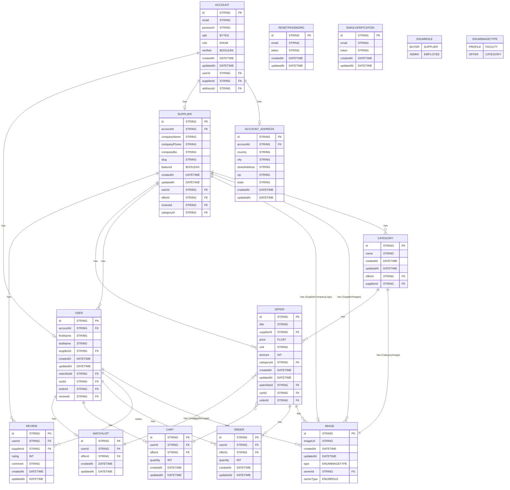

## Installation

To install and run the project on your local machine, please follow these steps:

1. Clone the repository to your local machine by running the following command in your terminal:

   ```
   git clone https://github.com/julklingel/hofmarkt.git
   ```

2. If not already existing, install pnpm on your machine by running the following command in your terminal:

   ```
   brew install pnpm
   ```

3. Install the project dependencies by running the following command in your terminal:

   ```
   pnpm install
   ```

4. Create a .env file in the root directory of the project and add your credentials in the following format:

```
# Backend
POSTGRES_HOST="localhost"
POSTGRES_PORT="5432"
POSTGRES_DB="backend"
POSTGRES_USER= <your-postgres-username>
POSTGRES_PASSWORD= <your-postgres-password>
DATABASE_URL="postgresql://${POSTGRES_USER}:${POSTGRES_PASSWORD}@${POSTGRES_HOST}:${POSTGRES_PORT}/${POSTGRES_DB}?schema=public"
JWT_secret= <your-jwt-secret>

# Cloudinary
CLOUDINARY_CLOUD_NAME=
CLOUDINARY_API_KEY=
CLOUDINARY_API_SECRET=

# Email
EMAIL_HOST="smtp.gmail.com"
EMAIL_PORT="587"
EMAIL_USER=
EMAIL_PASSWORD=

# Test
USER_TEST_EMAIL="testUser@mack.de"
USER_TEST_PASSWORD="pass123"

SUPPLIER_TEST_EMAIL="testSupplier@mack.de"
SUPPLIER_TEST_PASSWORD="pass123"

SUPPLIER_TEST_EMAIL_TWO="crack1@mack.de"
USER_TEST_EMAIL_TWO="jackiechan@kung-fu.de"

```

Make sure to replace `<your-postgres-username>`, `<your-postgres-password>` and `<your-jwt-secret>` with your actual values.

5. Create a docker-compose.yml file in the same directory with the following content:

```
services:
  postgres:
    image: postgres
    restart: always
    env_file:
      - .env
    environment:
      - POSTGRES_USER=${POSTGRES_USER}
      - POSTGRES_PASSWORD=${POSTGRES_PASSWORD}
    volumes:
      - postgres:/var/lib/postgresql/data
    ports:
      - '5432:5432'
volumes:
  postgres:
```

if this is not working, try to add the following docker-compose.yml file:

```
version: '3.8'
services:
  postgres:
    image: postgres:13
    ports:
      - '5432:5432'
    restart: always
    env_file:
        - .env
    environment:
      POSTGRES_USER: ${POSTGRES_USER}
      POSTGRES_PASSWORD: ${POSTGRES_PASSWORD}
      POSTGRES_DB: backend

volumes:
  postgres:
```

and for the testing environment add

```
test-db:
    image: postgres:13
    ports:
      - '5435:5432'
    restart: always
    env_file:
        - .env.test
    environment:
      POSTGRES_USER: ${POSTGRES_USER}
      POSTGRES_PASSWORD: ${POSTGRES_PASSWORD}
      POSTGRES_DB: backend

volumes:
  postgres:

```

6. If you haven't already, install the Docker Desktop application and open it.

7. In your terminal, navigate to backend in the project directory and run the following command to start the PostgreSQL container:

   ```
   docker-compose up
   ```

8. Once you are ready to migrate the database tables to your local database, run the following command in your terminal:

   ```
   npx prisma migrate dev
   ```

9. To reset the database to its initial state and see if everything is working, run the following command in your terminal:

   ```
   pnpm reset:db
   ```

That's it! You now have a local development environment for Hofmarkt up and running. If you have any questions or encounter any issues, please feel free to reach out to us. Happy coding!

## Running the app

```bash
# development
$ pnpm run start

# watch mode
$ pnpm run start:dev

# production mode
$ pnpm run start:prod
```

## Test

```bash
# integration test
$ pnpm test:integration
```

## REST API Description

### AuthController

The AuthController API provide a set of RESTful API endpoints for user authentication and password management. The following is an overview of the available endpoints:

POST /auth/signup: This endpoint is responsible for registering a new user. It takes a signupDto object as input with properties like email, password, and isSupplier. On successful registration, it returns a message "Account created successfully" and sends a confirmation email to the user.

POST /auth/login: This endpoint is responsible for authenticating a user. It takes a loginDto object as input with properties email and password. On successful authentication, it returns an access_token.

POST /auth/send-reset-mail: This endpoint is responsible for sending a reset password email to a user. It takes a resetMailDto object as input with the property email. On successful operation, it returns a message "Reset code sent successfully".

POST /auth/enter-resetCode: This endpoint is responsible for verifying a reset code sent to the user's email. It takes a resetTokenDto object as input with properties email and token. On successful verification, it returns a message "Reset code verified successfully" along with the token.

POST /auth/reset-password: This endpoint is responsible for resetting a user's password. It takes a resetPasswordDto object as input with properties email, token, and password. On successful password reset, it returns a message "Password changed successfully".

GET /auth/confirm/:email/:code: This endpoint is responsible for confirming a user's email address. It takes email and code as URL parameters. On successful email confirmation, it returns a new access_token.

### SupplierController

The SupplierController API delivers a collection of RESTful API endpoints devised for supplier management and associated image handling. The overview of available endpoints is as follows:

GET /supplier: This endpoint is responsible for retrieving a list of all suppliers.

GET /supplier/featured: This endpoint is responsible for retrieving a list of featured suppliers.

POST /supplier/create: This endpoint is responsible for creating a new supplier. It is protected by JWT authentication and restricted to users with a 'SUPPLIER' role. It takes a supplierDto object as input with properties like name, email, description, and phone number, along with an address object with properties like street, city, and country. It also accepts up to 6 image files, each with a maximum size of 1 MB. On successful supplier creation, it returns the created supplier object.

GET /supplier/:slug: This endpoint is responsible for retrieving a specific supplier by their slug.

PATCH /supplier/update/:id: This endpoint is responsible for updating an existing supplier by their ID. It is protected by JWT authentication and restricted to users with a 'SUPPLIER' role. It takes an updateSupplierDto object as input with properties like name, email, description, and phone number, along with an updateAddressDto object with properties like street, city, and country. It also accepts up to 4 image files, each with a maximum size of 2 MB. On successful supplier update, it returns the updated supplier object.

DELETE /supplier/delete/:id: This endpoint is responsible for deleting an existing supplier by their ID. It is protected by JWT authentication and restricted to users with a 'SUPPLIER' role. On successful supplier deletion, it returns a success message.

### UserController

The UserController API delivers a collection of RESTful API endpoints devised for user management and profile image handling. The overview of available endpoints is as follows:

GET /user/me: This endpoint is responsible for retrieving the information of the authenticated user. It is protected by JWT authentication and restricted to users with any role. It returns the user object.

POST /user/create: This endpoint is responsible for creating a new user. It is protected by JWT authentication and restricted to users with a 'BUYER' role. It takes a userDto object as input with properties like name, email, password, and phone number, along with an address object with properties like street, city, and country. It also accepts an image file with a maximum size of 1 MB. On successful user creation, it returns the created user object.

PATCH /user/update/id: This endpoint is responsible for updating an existing user by their ID. It is protected by JWT authentication and restricted to users with a 'BUYER' role. It takes an updateUserDto object as input with properties like name, email, password, and phone number, along with an updateAddressDto object with properties like street, city, and country. It also accepts an image file with a maximum size of 1 MB. On successful user update, it returns the updated user object.

DELETE /user/delete/id: This endpoint is responsible for deleting an existing user by their ID. It is protected by JWT authentication and restricted to users with a 'BUYER' role. On successful user deletion, it returns a success message.

### OfferController

The OfferController API provides a set of RESTful API endpoints for managing offers and their associated images. The following is an overview of the available endpoints:

GET /offer: This endpoint is responsible for retrieving a list of all offers with their supplier and image details.

GET /offer/:id: This endpoint is responsible for retrieving a specific offer by its ID.

GET /offer/supplier/:id: This endpoint is responsible for retrieving a list of offers made by a specific supplier, identified by their ID.

POST /offer/create: This endpoint is responsible for creating a new offer. It is protected by JWT authentication and restricted to users with a 'SUPPLIER' role. It takes an offerDto object as input with properties like title, price, unit, and amount, along with up to 4 image files, each with a maximum size of 2 MB. On successful offer creation, it returns the created offer object.

PATCH /offer/update/:id: This endpoint is responsible for updating an existing offer by its ID. It is protected by JWT authentication and restricted to users with a 'SUPPLIER' role. It takes an offerDto object as input with properties like title, price, unit, and amount, along with up to 4 image files, each with a maximum size of 2 MB. On successful offer update, it returns the updated offer object.

DELETE /offer/delete/:id: This endpoint is responsible for deleting an existing offer by its ID. It is protected by JWT authentication and restricted to users with a 'SUPPLIER' role. On successful offer deletion, it returns a success message.

## Project's Architecture


The flow of the backend architecture can be summarized as follows:

1. Users send requests to the backend, which is hosted serverless using Google Cloud Run.
2. A Content Delivery Network (CDN) intercepts these requests. The CDN caches content and serves it to users from the closest data center, reducing latency and improving performance.
3. Requests are forwarded to a load balancer, which applies rate limiting to prevent abuse and ensure fair usage.
4. The load balancer autoscales Docker container instances based on demand, ensuring the system can handle varying loads.
5. Each container runs an instance of the backend image, which starts with a validation pipeline.
6. The validation pipeline checks for required headers and sanitizes and validates the input values using Data Transfer Objects (DTOs) with validation decorators.
7. If the DTO is as expected, the request proceeds to the controller and is allocated to a specific request method.
8. Additional checks, such as authorization based on JSON Web Tokens (JWT) or image type/size validations, are performed.
9. If all checks pass, the request is forwarded to the service function where the core business logic is executed.
10. If necessary, Prisma, an Object-Relational Mapping (ORM) tool, is used to interact with the database.
11. The service function includes error handling, considering possible issues that may arise from the database or other parts of the system.
12. If the process is successful, the service function returns the resulting object or value to the controller.
13. The controller sends the response back through the load balancer, which ultimately returns the result to the client/user.

## CI / CD


At the heart of this workflow lies the Continuous Integration and Continuous Delivery/Deployment (CI/CD) philosophy. This means that developers frequently merge their code changes into a shared repository, and the application undergoes automatic build, test, and deployment processes.

The diagram showcases each stage of the workflow in detail, starting with the developer creating a new branch and pushing it to the Git repository. Once the code is pushed, it undergoes a rigorous code review by other developers to ensure that it meets the project's standards and guidelines.

Code review is an essential part of the process as it helps to identify and fix potential bugs and errors before they reach the main branch. This stage is crucial to ensuring that the final product is of high quality and meets the project's requirements.

After the code is reviewed and approved, it is merged into the main branch, triggering a GitHub Action pipeline. The pipeline is a series of automated processes that build, test, and deploy the application to the cloud.

The pipeline first builds a Docker image based on the updated code, which is then uploaded to a cloud platform such as Google Cloud. Once uploaded, the image undergoes further checks to ensure that all ports are listening and the environment is set up correctly. If all checks pass, a new backend instance is created, and traffic management is used to direct traffic to old revisions, allowing for a safe switch to the new productive instance.

The use of Docker images allows for greater flexibility and consistency in the development process. Docker provides a containerization environment where applications can be run in a portable and isolated manner, regardless of the underlying system or infrastructure.

The CI/CD approach ensures that the application is continuously updated, tested, and deployed in a consistent and reliable manner, reducing the risk of bugs and downtime.

## Code Ownership

Each branch is written by the branch owner only.

## ER Model



## My Brag: It was a lot of work for me to create the polymorphic relationship between the images and tables that have images. I think it was very interesting to learn that this kind of relationship was possible. This step helped to normalize my database.

## Cyber Security

Link to the documentation:
https://www.notion.so/Cyber-Security-8a50470ce4d64cf199ddfc92bff420c5?pvs=4

## Deployed

https://hofmarkt24.de/
